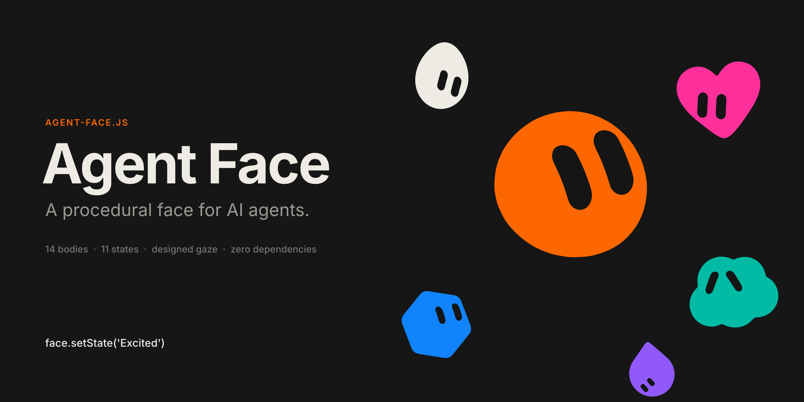
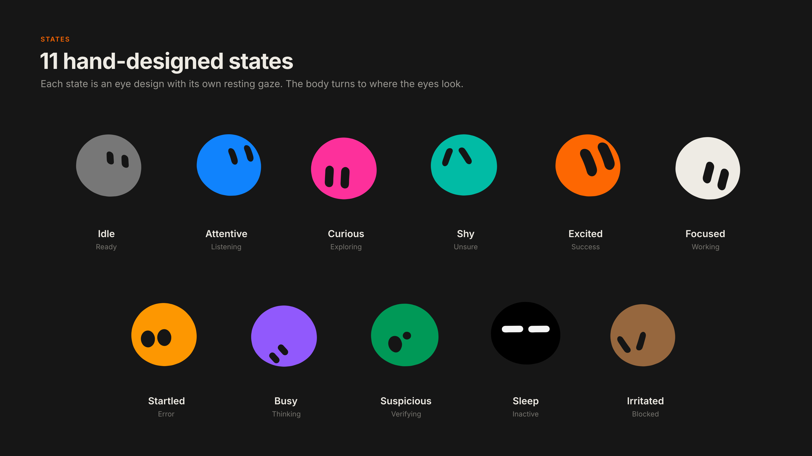
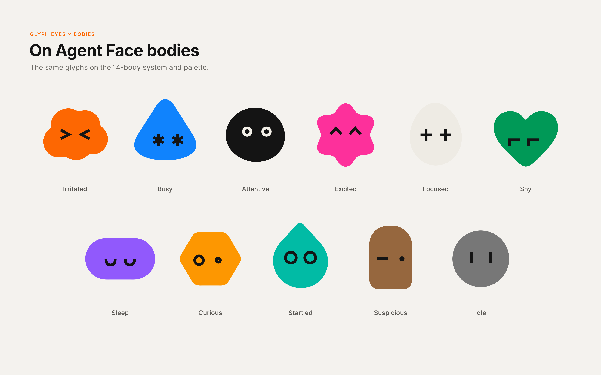
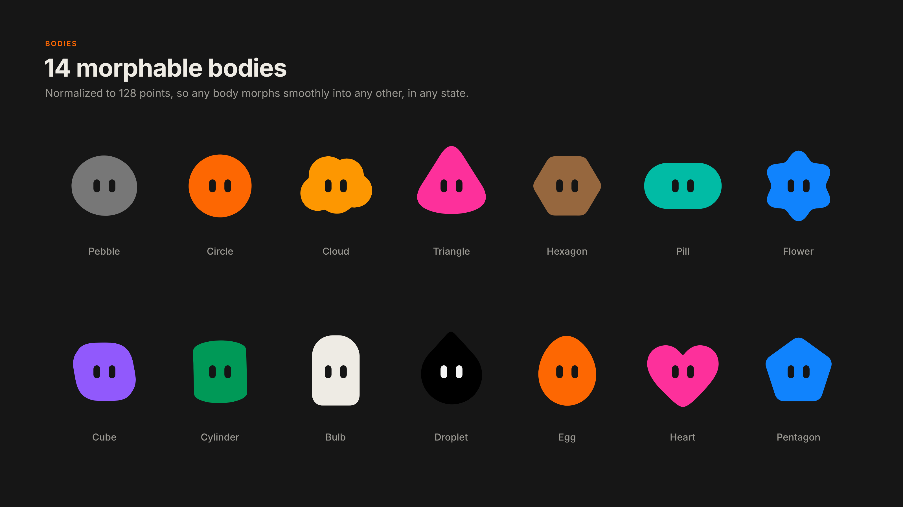
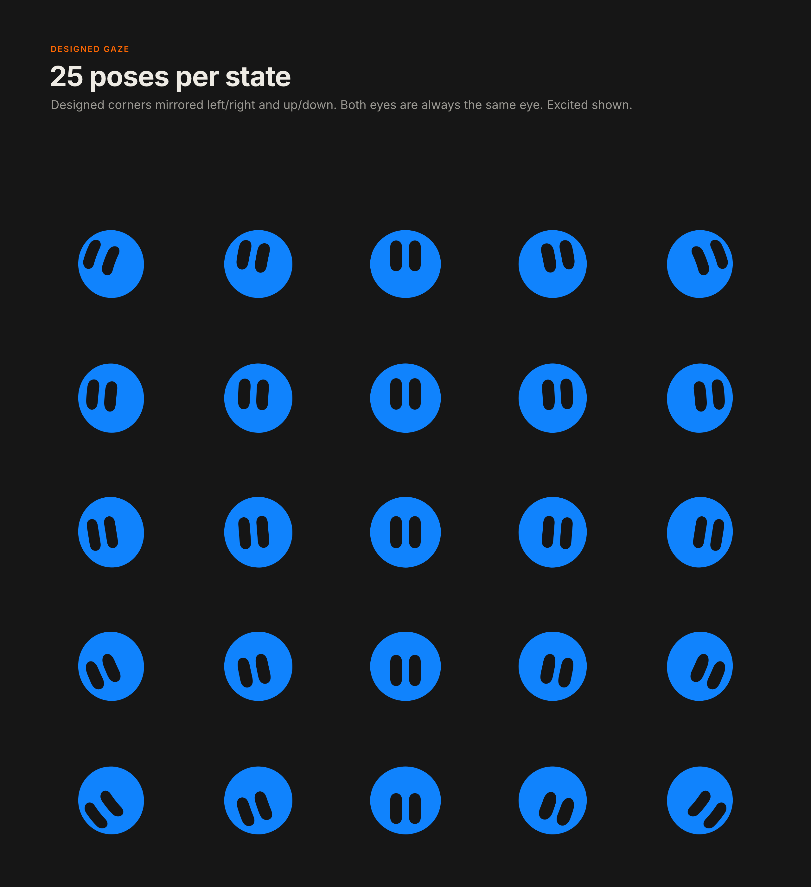

<div align="center">


# Agent Face

**A procedural, expressive face for AI agents.**

14 morphable bodies, 11 hand-designed states and a gaze that follows your users, in one dependency-free script.

[](agent-face.js)
[](agent-face.d.ts)
[](#how-it-works)
[](package.json)
[](agent-face.js)
[](LICENSE)
[](https://github.com/Brightwav3/agent-face/releases)
[](https://buymeacoffee.com/brightwave)
[](https://github.com/Brightwav3/agent-face/stargazers)

[Features](#features) · [Quick start](#quick-start) · [States](#states) · [Eye styles](#eye-styles) · [Bodies](#bodies) · [Gaze](#designed-gaze) · [API](#api) · [Frameworks](#frameworks) · [Build](#build-from-source)

</div>

<p align="center">
  
</p>

---

## Features

### Character
- 🫧 **14 bodies.** Pebble, Circle, Cloud, Triangle, Hexagon, Pill, Flower, Cube, Cylinder, Bulb, Droplet, Egg, Heart and Pentagon. Any body morphs smoothly into any other.
- 👀 **11 states.** Every state is an eye design drawn by hand in Affinity, from *Idle* and *Attentive* to *Busy*, *Startled* and *Sleep*.
- 🔣 **Two eye styles.** The drawn eyes, or a typographic glyph set (`^ ^`, `+ +`, `> <`, `* *` …), switchable at runtime.
- 🎨 **Palette.** Eleven colors out of the box, or any CSS color. In dark mode the eyes switch to black automatically. A black body always gets white eyes, an off-white body always gets black eyes.

### Alive
- 🧭 **Designed gaze.** While the pointer is over the face, the eyes blend between 9 designed poses per state instead of just sliding around.
- 🙂 **Body follows the eyes.** At rest, the body turns toward where the state's eyes look, so each state reads as a pose, not just a pair of eyes.
- 😌 **Blinks.** At irregular intervals, with the occasional double blink.
- 🔁 **Interruptible.** Change the state or body mid-animation and it retargets from the current frame.

### Under the hood
- 🪶 **Zero dependencies.** One file, `agent-face.js`, with all geometry embedded. Works as a `<script>`, a CommonJS module or a bundled import.
- 🧩 **TypeScript types** for every option, state and method.
- ♿ **Accessible.** An `aria-label` on the face, and `prefers-reduced-motion` turns all motion off.
- 🔋 **Efficient.** Rendering pauses when the face is off-screen; any number of faces share one pointer listener.

## Quick start

```html
<div id="face" style="width:160px;height:160px"></div>
<script src="agent-face.js"></script>
<script>
  const face = new AgentFace('#face', { shape: 'Pebble', color: 'orange', state: 'Idle' });

  face.setState('Attentive');  // the user is typing
  face.setState('Busy');       // the agent is thinking
  face.setState('Excited');    // done
</script>
```

The face fills its container. Give the container a size; 32 px and up works well.

With a bundler:

```js
import AgentFace from 'agent-face';
const face = new AgentFace(document.querySelector('#face'), { state: 'Idle' });
```

## States

<p align="center">
  
</p>

Each state is an eye design with its own resting gaze. The meanings below are suggestions; map them to your agent's events. They are also exported as `AgentFace.stateInfo`.

| State | Represents | Use for |
| --- | --- | --- |
| `Idle` | Ready | waiting for the first message, nothing running |
| `Attentive` | Listening | the user is typing or speaking |
| `Curious` | Exploring | reading files or a page, searching, asking a clarifying question |
| `Shy` | Unsure | low confidence, admitting a mistake, politely declining |
| `Excited` | Success | task done, good result, greeting |
| `Focused` | Working | running tools, writing code, a long task |
| `Startled` | Error | something failed, unexpected result, interrupted |
| `Busy` | Thinking | waiting for the model, generating the answer |
| `Suspicious` | Verifying | double-checking, a risky action, asking for permission |
| `Sleep` | Inactive | paused, offline, idle for a long time |
| `Irritated` | Blocked | rate-limited, access denied, the same thing failing again |

## Eye styles

<p align="center">
  
</p>

Besides the drawn eyes, every state has a typographic version: monoline glyphs with square caps.

```js
new AgentFace('#face', { eyes: 'glyph', state: 'Busy' });   // * *
face.setEyes('drawn');                                      // back to the drawn eyes
```

| State | Glyph | | State | Glyph |
| --- | --- | --- | --- | --- |
| `Idle` | `\| \|` | | `Startled` | `O O` |
| `Attentive` | `o o` | | `Busy` | `* *` |
| `Curious` | `O ·` | | `Suspicious` | `– ·` |
| `Shy` | `┌ ┌` | | `Sleep` | `◡ ◡` |
| `Excited` | `^ ^` | | `Irritated` | `> <` |
| `Focused` | `+ +` | | | |

Glyph eyes slide toward the pointer instead of using the gaze grid. A state change closes one glyph and opens the next.

## Bodies

<p align="center">
  
</p>

All bodies are normalized to 128 points around a shared optical center, so `setShape()` morphs between any two of them, in any state. The eyes always stay inside the outline and shrink only when a body is too narrow for them.

## Designed gaze

<p align="center">
  
</p>

Each state has 9 key poses, and the pointer position blends between them:

- **Corners** are the drawn design and its left/right mirror.
- **Looking down** is the vertical mirror of looking up for the oval-eyed states. `Shy`, `Irritated` and `Sleep` keep their shape, because there the slant *is* the emotion.
- **Looking straight on**, the eyes are clean capsules.

When the pointer leaves the face, it returns to the state's resting pose.

## API

### `new AgentFace(container, options?)`

| Option | Default | Description |
| --- | --- | --- |
| `shape` | `'Pebble'` | One of `AgentFace.shapes` |
| `state` | `'Idle'` | One of `AgentFace.states` (case-insensitive) |
| `color` | `'gray'` | A name from `AgentFace.colors`, or any CSS color |
| `theme` | `'auto'` | Eye color: `light` → white eyes, `dark` → black eyes, `auto` follows the system |
| `track` | `'element'` | Follow the pointer over the face (`'element'`), anywhere on the page (`'window'`), or not at all (`false`) |
| `trackRadius` | `0.9` | Reach of `'window'` tracking, relative to the face size |
| `followEyes` | `true` | Turn the body toward the state's resting gaze |
| `blink` | `true` | Automatic blinking |
| `label` | `'AI agent'` | Accessible name (`aria-label`) |
| `eyes` | `'drawn'` | Eye style: `'drawn'` or `'glyph'` |

### Methods

| Method | Description |
| --- | --- |
| `setState(name, { duration?, instant? })` | Morph the eyes to another state |
| `setShape(name, { duration?, instant? })` | Morph the body to another shape |
| `setColor(color)` | Change the body color |
| `setEyes(style)` | Switch between `'drawn'` and `'glyph'` eyes |
| `lookAt(x, y)` · `lookAt(null)` | Hold the gaze on a direction (−1…1, +x right, +y down), or release it |
| `blink()` | Blink now |
| `destroy()` | Remove the face and its listeners |

Setters return the instance, so calls can be chained.

### Static properties

`AgentFace.states` · `AgentFace.shapes` · `AgentFace.eyeStyles` · `AgentFace.colors` · `AgentFace.stateInfo`

## Frameworks

The pattern is the same everywhere: create the face on mount, call `setState()` when your agent's status changes, and call `destroy()` on unmount.

- **React:** [`examples/react/AgentFace.tsx`](examples/react/AgentFace.tsx)

  ```tsx
  <AgentFace state={isThinking ? 'Busy' : 'Idle'} shape="Heart" color="pink" size={48} />
  ```

- **Plain HTML:** [`examples/vanilla.html`](examples/vanilla.html)

## Demo

Open [`demo.html`](demo.html) in a browser to try every state, body and color, at several sizes.

## How it works

1. **Bodies.** Each outline is resampled to 128 points by arc length, centered on its area centroid and scaled to the same visual weight. A morph rotates the point order to the best match, then interpolates.
2. **Eyes.** Each eye is 64 points. State changes interpolate between eye sets the same way.
3. **Gaze.** A 3 × 3 grid of key poses per state is blended bilinearly from the pointer direction, then fitted inside the current body.
4. **Head.** A light lean, shift and compression toward the gaze gives a sense of depth. All drawing is a single SVG with Catmull-Rom curves through the points.

## Build from source

```bash
git clone https://github.com/Brightwav3/agent-face.git
cd agent-face
python3 src/build.py
```

This turns `src/agent-face.src.js` and `src/data.json` into `agent-face.js` and `demo.html`. To regenerate `src/data.json` from the design exports (`shapes.json`, `eyes.json`, `gaze.json`), run `python3 src/pack.py <folder>`.

### Project layout

```
agent-face.js          built component (ship this)
agent-face.d.ts        TypeScript types
demo.html              interactive demo
src/
├── agent-face.src.js  component source
├── data.json          packed geometry (bodies, states, gaze)
├── glyphs.json        glyph eye style (strokes per state)
├── demo.tpl.html      demo page template
├── build.py           builds agent-face.js and demo.html
└── pack.py            packs design exports into data.json
examples/              vanilla HTML and React usage
docs/images/           README images
design/                Affinity sources for the icon and images
```

## Support

Agent Face is free. If it helps your product, you can [buy me a coffee ☕](https://buymeacoffee.com/brightwave).

## License

[GPL-3.0](LICENSE) © 2026 Brightwave
